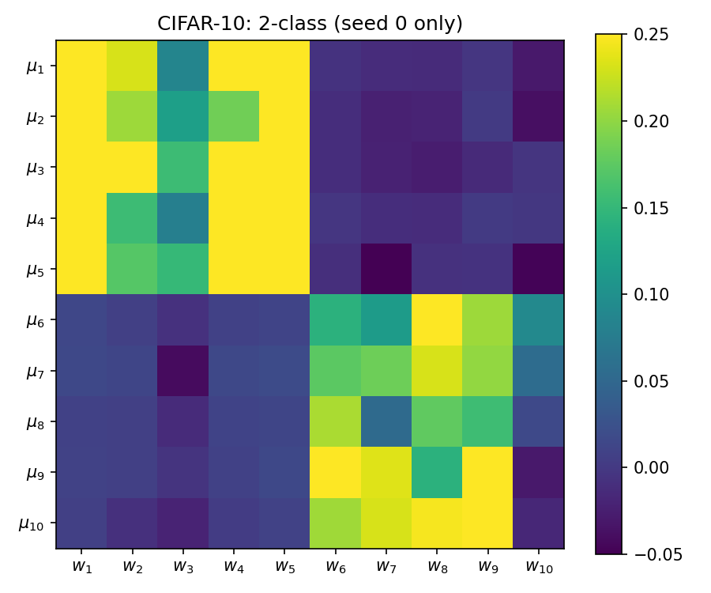
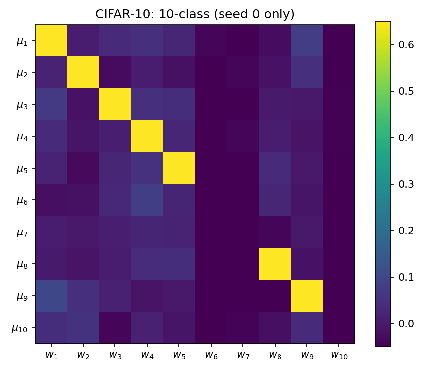
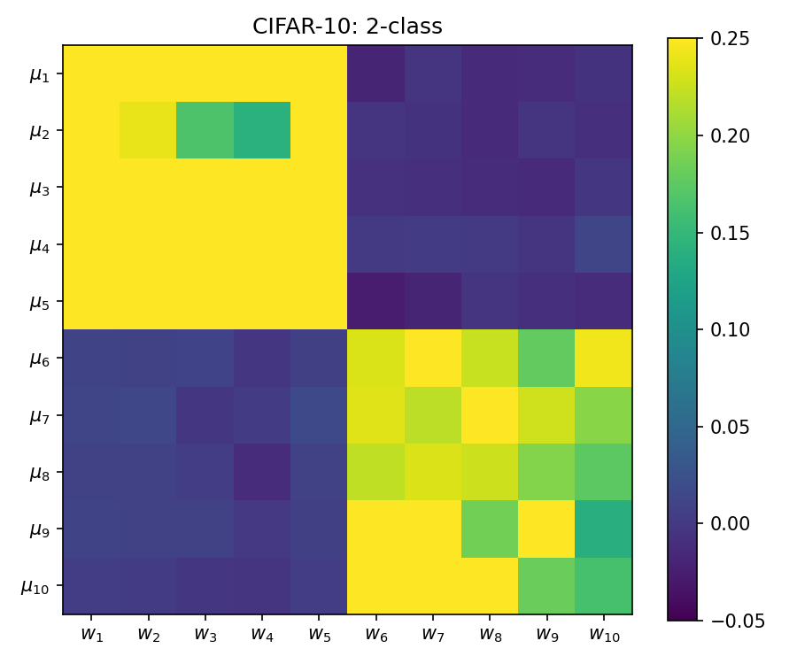
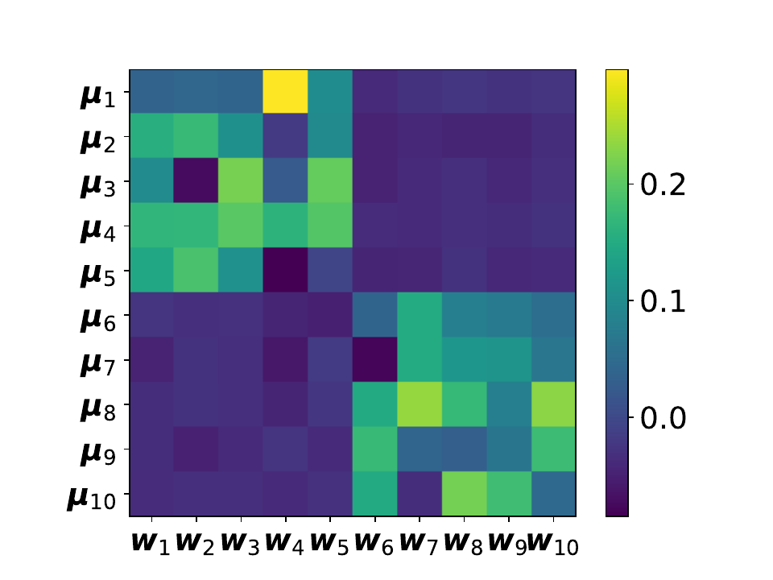
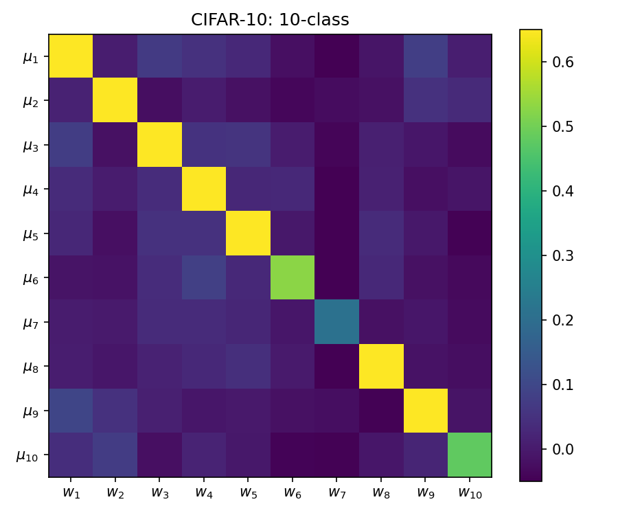
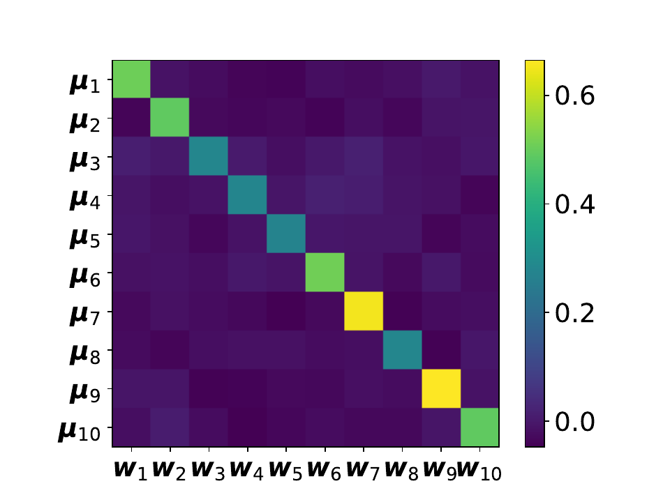
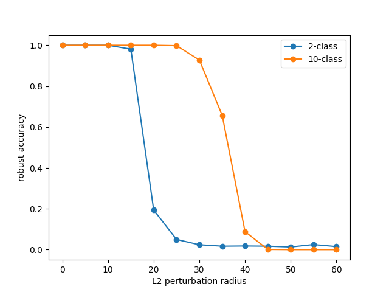
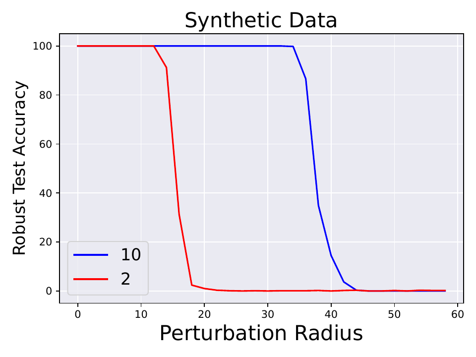
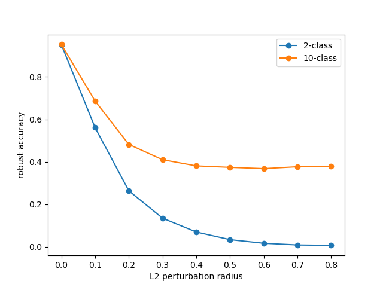
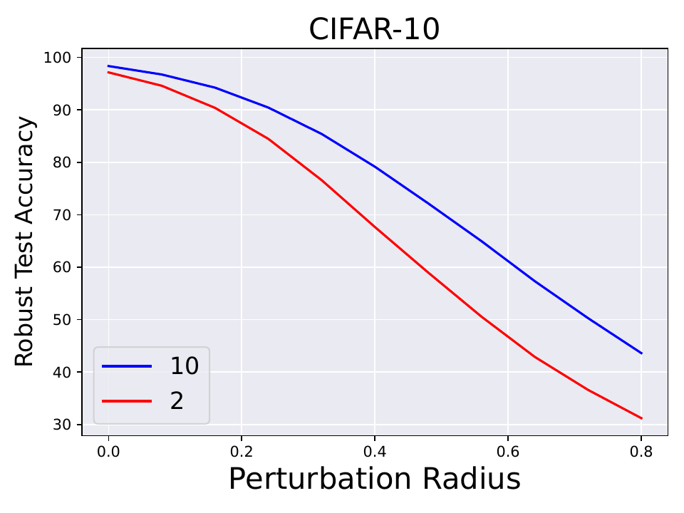

# Reproducing "Feature Averaging" (Li et al., ICLR 2025)

CENG 502 — Spring 2026 course project.

Paper: Binghui Li, Zhixuan Pan, Kaifeng Lyu, Jian Li.
**Feature Averaging: An Implicit Bias of Gradient Descent Leading to Non-Robustness in Neural Networks.**
ICLR 2025. [OpenReview](https://openreview.net/forum?id=zPHra4V5Mc)

## Overview of the Paper

The paper identifies an implicit bias of gradient descent it calls *feature averaging*. From the introduction:

> We show that, even when multiple discriminative features are present in the input data, neural networks trained by gradient descent tend to rely on an average (or a certain combination) of these features for classification, rather than distinguishing and leveraging each feature individually.


They create a synthetic dataset where each cluster has a mean feature vector and these vectors are set to be orthogonal, which ensures there is no correlation between the features. They then train a two-layer ReLU network with 2m hidden neurons and a scalar output (d → 2m → 1). The second layer is frozen: m of the hidden neurons go to the output with weight +1/m, the other m with weight −1/m. So the network's output is the average ReLU activation of the "positive" neurons minus the average activation of the "negative" neurons, and only the first layer (weights and biases) is trained by gradient descent. For example, with k=10 clusters and m=5 the hidden layer has 10 neurons in total: 5 positive and 5 negative. The paper shows that in this setting the first layer's weights converge to the average of the cluster centers within the same class, which they call feature averaging. This leads to non-robustness because the averaged feature has a clean adversarial direction (the negation of the average), so a small perturbation can flip the classification.

<p align="center">
  
</p>

*Figure 1: Schematic for k=5 clusters from the paper. μ_1, μ_2, μ_3 belong to the positive class (red) and μ_4, μ_5 to the negative class (blue). The feature-averaging classifier $f_{FA}$ uses two neurons aligned with the class averages μ_+ and μ_-, giving the gray linear decision boundary. The feature-decoupling classifier $f_{FD}$ keeps one neuron per cluster μ_j, giving the green polyhedral boundary. Points sit much further from the green boundary than from the gray line, which is why the decoupled solution is more robust to small perturbations.*

The difference between $f_{FA}$ and $f_{FD}$ is just in the output head and the labels: $f_{FA}$ has a single scalar output trained on binary ±1 labels with logistic loss; $f_{FD}$ has k outputs (one per cluster) trained on cluster-index labels with cross-entropy. The data, the cluster geometry, and the optimizer (plain gradient descent) are exactly the same.

They start with the synthetic dataset because it matches the theoretical setup exactly: the cluster centers are orthogonal and have equal norms, the loss and optimizer are plain logistic / cross-entropy with gradient descent, and feature averaging or decoupling can be read straight off the cosine matrix between the learned weights and the cluster means. Real datasets only approximate this setup, so they use MNIST and CIFAR-10 as a second sanity check. For MNIST the binary task is parity (odd vs even digits) and the multi-class task is the standard 10-way classification. For CIFAR-10 the binary task merges the first five classes vs the last five, against the same standard 10-way task. In both cases the network is ResNet-18 trained from scratch, the 10-class model is read out as a binary classifier by summing logits per side, and the comparison is robust accuracy under PGD L2 attacks at increasing perturbation radii.

## Reproducing the Paper

### Step 1: Synthetic Data Generation

<p align="center">
  
</p>

*Figure 2: Section 3.1 of the paper. Definition of the multi-cluster data distribution and its two simplifying assumptions.*

This is implemented in `dataset.py`. We first get a random Gaussian matrix of shape (d, k)  (this part was not specified in the paper, I assume authors asserts any data distribution satisfying the assumptions would work, so I just picked a simple one). Then, to satisfy Assumption 3.2, we take the QR decomposition to get k orthogonal vectors, and scale them by √d to get the right norm. To satisfy Assumption 3.3, we fix a partition of the k clusters into two equal halves, one for each class. The three sampling steps of Definition 3.1 then take a few lines:

```python
# Cluster features (Assumption 3.2: orthogonal, norm sqrt(d))
A = rng.standard_normal((d, K))       # random Gaussian matrix
Q, _ = np.linalg.qr(A)
self.mean_vectors = Q.T * np.sqrt(d)

# Partition J_+ / J_- (Assumption 3.3: balanced)
self.class_labels = np.where(np.arange(K) < K // 2, 1, -1)

# Definition 3.1 sampling
j = rng.integers(0, K, size=n)                                          # step 1: j ~ Unif([K])
y = self.class_labels[j]                                                # step 2: y by partition
x = self.mean_vectors[j] + rng.standard_normal((n, d))                  # step 3: x = mu_j + xi
```

The paper's synthetic experiments use k=10, d=3072, n=1000.

### Step 2: Setting the Model: Two-Layer ReLU Network

<p align="center">
  
</p>

*Figure 3: Section 3.2 of the paper. The simplified two-layer ReLU network with a fixed second layer of ±1/m coefficients.*

This is implemented in `model.py` as `TwoLayerReLU`. We store the 2m hidden neurons in a single (2m, d) weight tensor: the first m rows are the "positive" neurons (a_r = +1/m), the last m are the "negative" ones (a_r = −1/m). Only W and b are trainable; the second-layer vector a is registered as a buffer so it never receives gradients.

```python
class TwoLayerReLU(nn.Module):

    def __init__(self, d, m=5, sigma_w=1e-5, sigma_b=1e-5, seed=None):
        super().__init__()
        self.d, self.m = d, m
        M = 2 * m  # total hidden neurons

        gen = torch.Generator().manual_seed(seed) if seed is not None else None

        # first layer -- trainable
        self.W = nn.Parameter(torch.empty(M, d).normal_(0.0, sigma_w, generator=gen))
        self.b = nn.Parameter(torch.empty(M).normal_(0.0, sigma_b, generator=gen))

        # second layer -- fixed
        a = torch.cat([torch.full((m,), 1.0 / m), torch.full((m,), -1.0 / m)])
        self.register_buffer("a", a)

    def forward(self, x):
        pre = x @ self.W.t() + self.b          # (batch, 2m) pre-activations
        return relu(pre) @ self.a              # (batch,)
```

The paper's synthetic experiment uses m=5, so the hidden layer has 2m=10 neurons. The small initialization scale (sigma_w = sigma_b = 1e-5) matches the paper's small-init regime that the theory relies on.

### Step 3: Training and Reproducing Figure 2

Both networks share the same recipe: full-batch gradient descent for T=100 iterations, learning rate eta=0.001, random initialization with scale 1e-5. The only differences are the loss and the labels: the 2-class network uses logistic loss on ±1 labels (`train.py`), and the 10-class network uses softmax cross-entropy on cluster indices (`train_10class.py`).

```python
# train.py (binary)
loss = F.softplus(-y * model(x)).mean()

# train_10class.py (multi-class)
loss = F.cross_entropy(model(x), y)
```

After training, we compute the cosine similarity between each cluster center μ_i and each neuron weight w_j. For the 10-class case the "equivalent weight" of sub-network f_j is (1/h) Σ_r w_{j,r}, which for h=1 simplifies to w_j itself. The heatmaps map directly to Figure 2 of the paper.

|  | Mine | Paper |
|---|---|---|
| 2-class (FA) |  |  |
| 10-class (FD) |  |  |

The 2-class run shows two clean 5×5 blocks at cosine ≈ 0.44. Each positive neuron is roughly equally aligned with all 5 positive-class clusters, which is the feature-averaging signature. The 10-class run is a sharp diagonal at cosine ≈ 0.99: each neuron has converged to its own cluster center.

### Step 4: CIFAR-10 Feature Averaging and Decoupling (Figure 2 c, d)

This is the same averaging vs decoupling story on real images. The paper reuses the trained CIFAR-10 ResNet-18 (`cifar_10class.pt`) as a frozen feature extractor: the extracted embedding `z ∈ R^512` plays the role of the cluster-feature space, and a fresh small head is trained on top of it. For each CIFAR class we compute the per-class mean feature μ_i, by averaging the embeddings of all images in that class.

Two heads are trained on top of the 50k frozen features, both with the same total head width of 30:
- **10-class head**: `MultiClassReLU(d=512, k=10, h=3)`, with 30 neurons in 10 groups of 3, softmax cross-entropy on the original CIFAR labels.
- **2-class head**: `TwoLayerReLU(d=512, m=15)`, with 15 positive + 15 negative neurons, biases, scalar output, logistic loss on the binary labels (first 5 classes → +1, last 5 → −1).

To compare them at a common shape, the 2-class network's 15 + 15 weights are equally split into 5 + 5 groups of 3 and averaged within each group. This gives 10 "equivalent weights" for the binary network that line up against the 10 equivalent weights of the multi-class one.

The other hyperparameters are not stated in the paper, so we keep the same recipe as the synthetic experiment: plain full-batch gradient descent for T=300 iterations, learning rate eta=0.01. 

```python
head10 = MultiClassReLU(d=512, k=10, h=3, sigma_w=1e-2, seed=seed)
# F.cross_entropy(head10(z), y10) ...

head2 = TwoLayerReLU(d=512, m=15, sigma_w=1e-2, sigma_b=1e-2, seed=seed)
# F.softplus(-y_binary * head2(z)).mean() ...

# Equivalent weights
W10 = head10.W.reshape(10, 3, 512).mean(dim=1)                            # (10, 512)
W2  = torch.cat([head2.W[:15].reshape(5, 3, 512).mean(dim=1),
                 head2.W[15:].reshape(5, 3, 512).mean(dim=1)], dim=0)     # (10, 512)
```

The training script is `train_cifar_head.py` and the cosine analysis in `analysis_cifar.py`.

#### Single-seed result

Running the above once with seed=0:

|  | 2-class | 10-class |
|---|---|---|
| Mine (seed 0) |  |  |

The 2-class panel already shows the expected block pattern. The 10-class panel is a problem: only 7 of the 10 diagonal entries light up. Three columns (`w_6`, `w_7`, `w_10`, corresponding to CIFAR's "dog", "frog", "truck") are completely flat, meaning those 3-neuron groups never decoupled into the respective cluster features. This matches the training accuracy of the 10-class head, which ended at only 69.9% on the train set with this seed, far below the pretrained ResNet-18's clean accuracy of around 95%. We guess that the missed hyperparameters (initialization scale, learning rate, number of iterations) not missing the those authprs used might be the problem. To mitigate this, we can run multiple seeds and average the cosine matrices across them.

#### Averaging across seeds

 Running the same procedure with seeds {0, 1, 2}, the per-seed training accuracies of the 10-class head are 70%, 90%, and 99.9%, and the averaged cosine matrices look like:

|  | Mine (averaged over 3 seeds) | Paper |
|---|---|---|
| 2-class (FA) |  |  |
| 10-class (FD) |  |  |

The block pattern in 2-class and the diagonal in 10-class are now both clean. Averaging across seeds reflects the feature averaging vs decoupling story even better than the paper's original figure.

### Step 5: Robustness Under PGD L₂ Attacks (Figure 3)

The paper's central empirical claim is that the 10-class model, used as a binary classifier via the summed-logit, is significantly more robust to adversarial perturbations than the 2-class model trained directly. We test this with L₂-bounded PGD attacks at increasing perturbation radii.

The paper specifies only "standard PGD attacks (Madry 2018) with different ℓ2-perturbation radius" and defers the rest to the Madry reference. We follow Madry's recipe directly: 40 PGD iterations, step size α = 2.5·ε/T, random initialization inside the ε-ball, and (for CIFAR-10) clipping x + δ back to [0, 1] after each step. The synthetic attack lives in `attack.py`, the CIFAR attack in `attack_cifar.py`.

**Attacking each model on its native loss.** We first got this part wrong. The paper describes the 10-class model's "binary classification output" (sum of J+ logits minus sum of J- logits). A natural first reading is that PGD should attack this binary readout directly. With that formulation, our 10-class CIFAR model came out *less* robust than the 2-class one. The reason is that attacking the binary readout gives the attacker k=10 free logits to push (the attacker can flip the readout's sign by moving any one of them), while the 2-class network only has 2 output logits to attack. For the 10-class model that means CE on the original CIFAR label, which flips the predicted class but does not necessarily flip the predicted binary group.

```python
# attack_cifar.py: attack each model on its native CE loss
loss = F.cross_entropy(model(x + delta), y, reduction="sum")
```

#### Synthetic dataset

|  | Mine | Paper |
|---|---|---|
| Figure 3 (left) |  |  |

The 2-class model cliffs around ε ≈ 18 and the 10-class around ε ≈ 38. The paper's theoretical gap is √k = √10 ≈ 3.16×; the observed ratio between the two cliffs in our run is roughly 2.1×, which is in the right order of magnitude. Qualitatively the curve shapes matches with the paper.

#### CIFAR-10

|  | Mine | Paper |
|---|---|---|
| Figure 3 (right) |  |  |

The qualitative shape matches: 10-class sits consistently above 2-class, the 2-class curve collapses to near zero by ε ≈ 0.4, and the 10-class curve plateaus around 37% by ε ≈ 0.5.

The absolute robustness numbers are lower than the paper's (at ε = 0.4 the paper reports about 75% for 10-class and 60% for 2-class; ours are 38% / 7%). We attribute this to missing hyperparameters in the paper's recipe, including: number of PGD iterations, the per-step projection size, and the test-set size used for the evaluation. We keep this part as is for now because of the time constraints.

## Code Structure

```
dataset.py             synthetic data distribution (Definition 3.1)
model.py               TwoLayerReLU and MultiClassReLU heads
resnet.py              CIFAR-style ResNet-18

train.py               train synthetic 2-class network (Step 3)
train_10class.py       train synthetic 10-class network (Step 3)
train_cifar.py         train ResNet-18 on CIFAR-10 (Steps 4 and 5)
train_cifar_head.py    train heads on frozen CIFAR features (Step 4)

analysis.py            cosine matrix for synthetic 2-class (Step 3)
analysis_10class.py    cosine matrix for synthetic 10-class (Step 3)
analysis_cifar.py      cosine matrices for CIFAR heads (Step 4)

attack.py              synthetic PGD L2 (Step 5)
attack_cifar.py        CIFAR-10 PGD L2 (Step 5)
plot_robust.py         plot synthetic robustness curve (Step 5)
plot_cifar.py          plot CIFAR robustness curve (Step 5)

checkpoints/           trained model weights and saved attack results
figures/               reproduction plots; figures/paper/ has paper originals
scripts/               SLURM scripts used on TRUBA HPC
data/                  CIFAR-10, auto-downloaded by torchvision on first run
```

## Running the Code

Install the dependencies once:

```bash
pip install torch torchvision matplotlib numpy
```

To reproduce **Step 3 (Figure 2 a, b)**:

```bash
python train.py             # checkpoints/model_2class.pt
python train_10class.py     # checkpoints/model_10class.pt
python analysis.py          # figures/syn_average_repro.png
python analysis_10class.py  # figures/syn_decouple_repro.png
```

To reproduce **Step 4 (Figure 2 c, d)** (requires a trained CIFAR-10 ResNet-18):

```bash
python train_cifar.py       # checkpoints/cifar_2class.pt, cifar_10class.pt
python train_cifar_head.py  # checkpoints/cifar_heads.pt (3 seeds)
python analysis_cifar.py    # figures/cifar_average_*.png, cifar_decouple_*.png
```

To reproduce **Step 5 (Figure 3 robustness curves)**:

```bash
# synthetic (Figure 3 left)
python attack.py            # checkpoints/robust_results.pt
python plot_robust.py       # figures/syn_robust_repro.png

# CIFAR-10 (Figure 3 right), reuses cifar_*class.pt from Step 4
python attack_cifar.py      # checkpoints/cifar_robust_results.pt
python plot_cifar.py        # figures/cifar_robust_repro.png
```

Synthetic training and analysis run in seconds on CPU. CIFAR-10 training of ResNet-18 takes around 30 minutes on a GTX 1060. The heads-only training in Step 4 runs under a minute on GTX 1060.