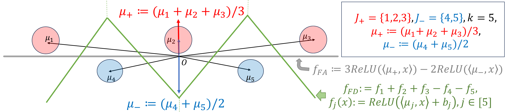
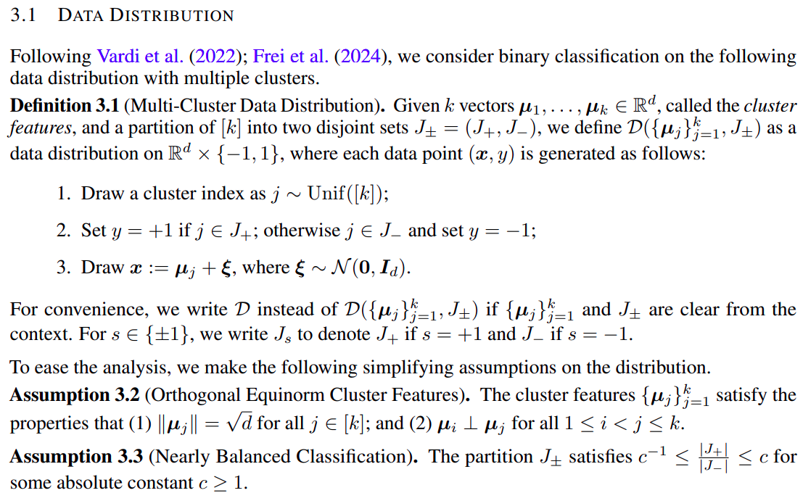
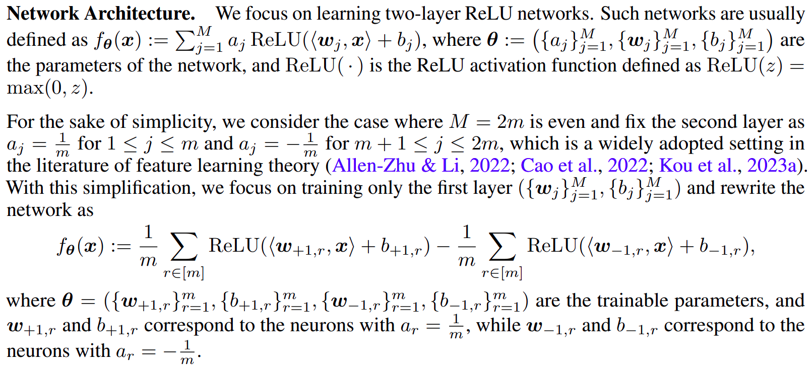
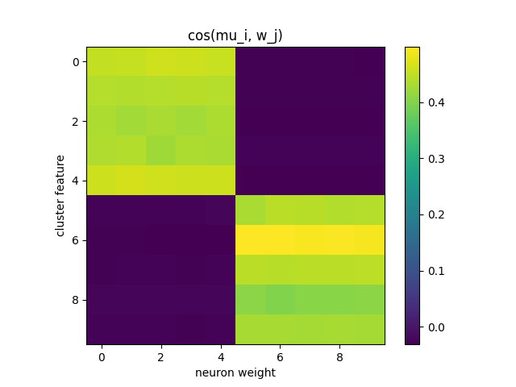
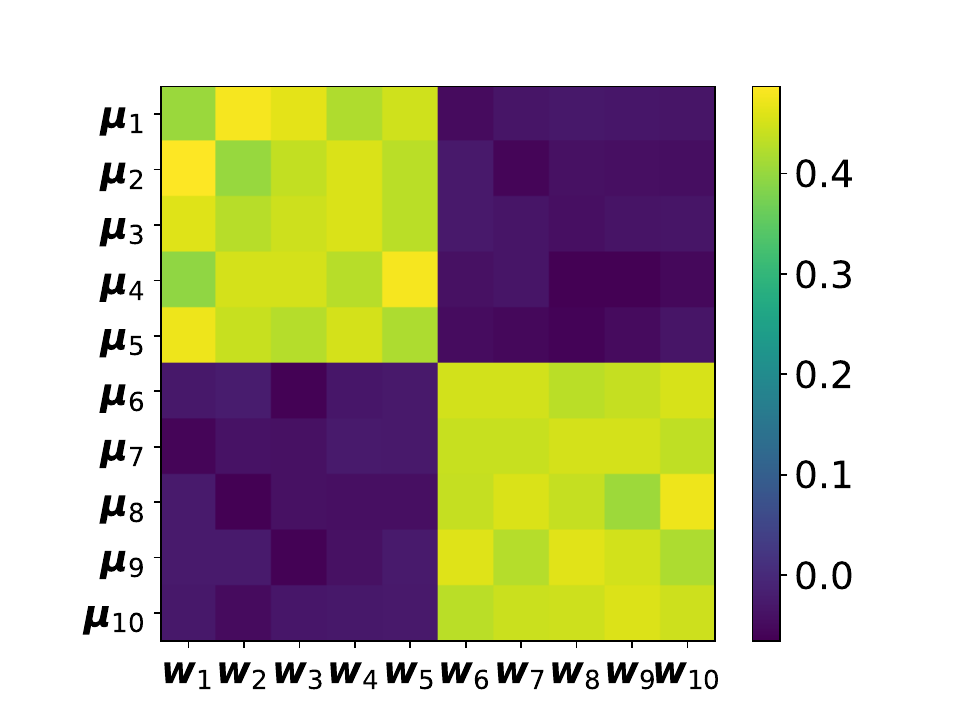
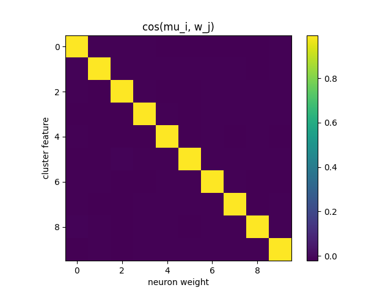
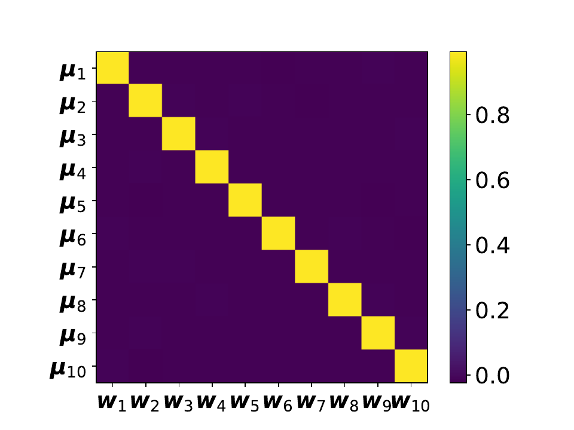

# Reproducing "Feature Averaging" (Li et al., ICLR 2025)

CENG 502 — Spring 2026 course project.

Paper: Binghui Li, Zhixuan Pan, Kaifeng Lyu, Jian Li.
**Feature Averaging: An Implicit Bias of Gradient Descent Leading to Non-Robustness in Neural Networks.**
ICLR 2025. [OpenReview](https://openreview.net/forum?id=zPHra4V5Mc)

## Overview of the Paper

The paper identifies an implicit bias of gradient descent it calls *feature averaging*. From the introduction:

> We show that, even when multiple discriminative features are present in the input data, neural networks trained by gradient descent tend to rely on an average (or a certain combination) of these features for classification, rather than distinguishing and leveraging each feature individually.


They create a synthetic dataset where each cluster has a mean feature vector and these vectors are set to be orthogonal, which ensures there is no correlation between the features. They then train a two-layer ReLU network with 2m hidden neurons and a scalar output (d → 2m → 1). The second layer is frozen: m of the hidden neurons go to the output with weight +1/m, the other m with weight −1/m. So the network's output is the average ReLU activation of the "positive" neurons minus the average activation of the "negative" neurons, and only the first layer (weights and biases) is trained by gradient descent. For example, with k=10 clusters and m=5 the hidden layer has 10 neurons in total: 5 positive and 5 negative. The paper shows that in this setting the first layer's weights converge to the average of the cluster centers within the same class, which they call feature averaging. This leads to non-robustness because the averaged feature has a clean adversarial direction (the negation of the average), so a small perturbation can flip the classification.

<p align="center">
  
</p>

*Figure 1: Schematic for k=5 clusters from the paper. μ_1, μ_2, μ_3 belong to the positive class (red) and μ_4, μ_5 to the negative class (blue). The feature-averaging classifier $f_{FA}$ uses two neurons aligned with the class averages μ_+ and μ_-, giving the gray linear decision boundary. The feature-decoupling classifier $f_{FD}$ keeps one neuron per cluster μ_j, giving the green polyhedral boundary. Points sit much further from the green boundary than from the gray line, which is why the decoupled solution is more robust to small perturbations.*

The difference between $f_{FA}$ and $f_{FD}$ is just in the output head and the labels: $f_{FA}$ has a single scalar output trained on binary ±1 labels with logistic loss; $f_{FD}$ has k outputs (one per cluster) trained on cluster-index labels with cross-entropy. The data, the cluster geometry, and the optimizer (plain gradient descent) are exactly the same.

They start with the synthetic dataset because it matches the theoretical setup exactly: the cluster centers are orthogonal and have equal norms, the loss and optimizer are plain logistic / cross-entropy with gradient descent, and feature averaging or decoupling can be read straight off the cosine matrix between the learned weights and the cluster means. Real datasets only approximate this setup, so they use MNIST and CIFAR-10 as a second sanity check. For MNIST the binary task is parity (odd vs even digits) and the multi-class task is the standard 10-way classification. For CIFAR-10 the binary task merges the first five classes vs the last five, against the same standard 10-way task. In both cases the network is ResNet-18 trained from scratch, the 10-class model is read out as a binary classifier by summing logits per side, and the comparison is robust accuracy under PGD L2 attacks at increasing perturbation radii.

## Reproducing the Paper

### Step 1: Synthetic Data Generation

<p align="center">
  
</p>

*Figure 2: Section 3.1 of the paper. Definition of the multi-cluster data distribution and its two simplifying assumptions.*

This is implemented in `dataset.py`. We first get a random Gaussian matrix of shape (d, k)  (this part was not specified in the paper, I assume authors asserts any data distribution satisfying the assumptions would work, so I just picked a simple one). Then, to satisfy Assumption 3.2, we take the QR decomposition to get k orthogonal vectors, and scale them by √d to get the right norm. To satisfy Assumption 3.3, we fix a partition of the k clusters into two equal halves, one for each class. The three sampling steps of Definition 3.1 then take a few lines:

```python
# Cluster features (Assumption 3.2: orthogonal, norm sqrt(d))
A = rng.standard_normal((d, K))       # random Gaussian matrix
Q, _ = np.linalg.qr(A)
self.mean_vectors = Q.T * np.sqrt(d)

# Partition J_+ / J_- (Assumption 3.3: balanced)
self.class_labels = np.where(np.arange(K) < K // 2, 1, -1)

# Definition 3.1 sampling
j = rng.integers(0, K, size=n)                                          # step 1: j ~ Unif([K])
y = self.class_labels[j]                                                # step 2: y by partition
x = self.mean_vectors[j] + rng.standard_normal((n, d))                  # step 3: x = mu_j + xi
```

The paper's synthetic experiments use k=10, d=3072, n=1000.

### Step 2: Setting the Model: Two-Layer ReLU Network

<p align="center">
  
</p>

*Figure 3: Section 3.2 of the paper. The simplified two-layer ReLU network with a fixed second layer of ±1/m coefficients.*

This is implemented in `model.py` as `TwoLayerReLU`. We store the 2m hidden neurons in a single (2m, d) weight tensor: the first m rows are the "positive" neurons (a_r = +1/m), the last m are the "negative" ones (a_r = −1/m). Only W and b are trainable; the second-layer vector a is registered as a buffer so it never receives gradients.

```python
class TwoLayerReLU(nn.Module):

    def __init__(self, d, m=5, sigma_w=1e-5, sigma_b=1e-5, seed=None):
        super().__init__()
        self.d, self.m = d, m
        M = 2 * m  # total hidden neurons

        gen = torch.Generator().manual_seed(seed) if seed is not None else None

        # first layer -- trainable
        self.W = nn.Parameter(torch.empty(M, d).normal_(0.0, sigma_w, generator=gen))
        self.b = nn.Parameter(torch.empty(M).normal_(0.0, sigma_b, generator=gen))

        # second layer -- fixed
        a = torch.cat([torch.full((m,), 1.0 / m), torch.full((m,), -1.0 / m)])
        self.register_buffer("a", a)

    def forward(self, x):
        pre = x @ self.W.t() + self.b          # (batch, 2m) pre-activations
        return relu(pre) @ self.a              # (batch,)
```

The paper's synthetic experiment uses m=5, so the hidden layer has 2m=10 neurons. The small initialization scale (sigma_w = sigma_b = 1e-5) matches the paper's small-init regime that the theory relies on.

### Step 3: Training and Reproducing Figure 2

Both networks share the same recipe: full-batch gradient descent for T=100 iterations, learning rate eta=0.001, random initialization with scale 1e-5. The only differences are the loss and the labels: the 2-class network uses logistic loss on ±1 labels (`train.py`), and the 10-class network uses softmax cross-entropy on cluster indices (`train_10class.py`).

```python
# train.py (binary)
loss = F.softplus(-y * model(x)).mean()

# train_10class.py (multi-class)
loss = F.cross_entropy(model(x), y)
```

After training, we compute the cosine similarity between each cluster center μ_i and each neuron weight w_j. For the 10-class case the "equivalent weight" of sub-network f_j is (1/h) Σ_r w_{j,r}, which for h=1 simplifies to w_j itself. The heatmaps map directly to Figure 2 of the paper.

|  | Mine | Paper |
|---|---|---|
| 2-class (FA) |  |  |
| 10-class (FD) |  |  |

The 2-class run shows two clean 5×5 blocks at cosine ≈ 0.44. Each positive neuron is roughly equally aligned with all 5 positive-class clusters, which is the feature-averaging signature. The 10-class run is a sharp diagonal at cosine ≈ 0.99: each neuron has converged to its own cluster center.